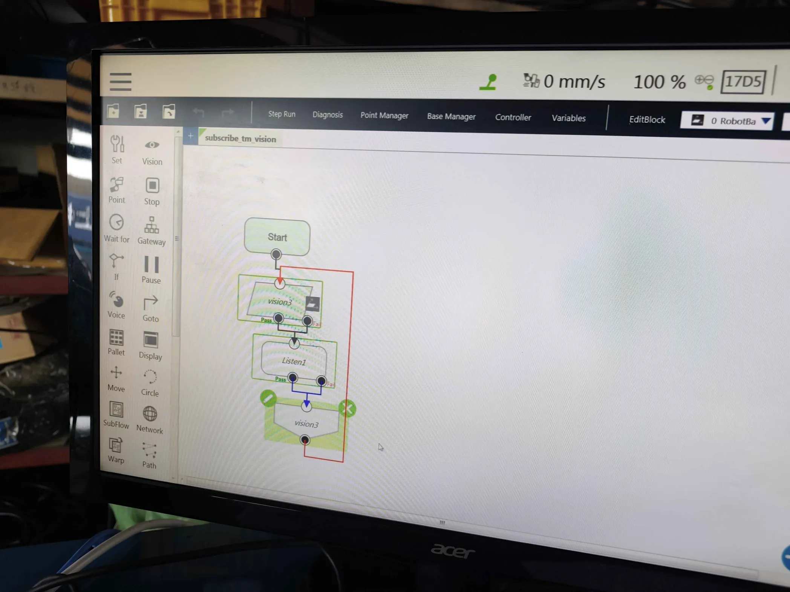

# Cobot Pick Place Vision System

## 1. Overview
This project provides a set of ROS 2 nodes and Python scripts for computer vision and robotics tasks, specifically generating ArUco markers, calibrating the camera, and performing an autonomous pick-and-place stacking sequence using the Techman TM5-700 cobot.

## 2. Requirements

- **OS & ROS Version**: Ubuntu 22.04 with ROS 2 Humble.
- **TM ROS 2 Driver**: This repository includes a modified ROS 2 Driver from `https://github.com/tm-robot/tmr_ros2.git`.
- **Python Dependencies**:
  Install the required dependencies for both the vision processing and general utilities:
  ```bash
  pip install -r requirements.txt
  pip install flask waitress opencv-python numpy datetime
  ```

## 3. Setup / Installation

### Workspace Build
Build the ROS 2 workspace:
```bash
cd ~/cobot-pick-place
colcon build
source install/setup.bash
```

### TMflow Listen Node Setup
The Listen node establishes a socket server to communicate with ROS.
For the full setup tutorial, please refer to the [TMflow Listen node setup guide](tmr_ros2/README.md#%C2%A7-tmflow-listen-node-setup).

> [!IMPORTANT]
> **Timeout Configuration**: You must configure the timeout for the listen node to ensure the loop runs continuously without aborting prematurely.

### TMflow Vision Node Setup
The Vision node connects the cobot's built-in camera to your ROS PC.
For the full setup tutorial, please refer to the [TMflow Vision node setup guide](tmr_ros2/README.md#%C2%A7-tmflow-vision-node-setup).

### Required TMflow Project Flow
When combining both the Vision node and the Listen node in your TMflow project, your workflow should look like this:



## 4. How to Use

Before running the pick-and-place logic, you need to establish the connection to the cobot and its camera.

### Step 1: Activate TM Driver & Nodes

1. **Start the TM Driver and MoveGroup**:
   Open a terminal and run:
   ```bash
   ros2 launch tm_move_group tm5-700_run_move_group.launch.py robot_ip:=<robot_ip_address>
   ```
2. **Start the Image Talker**:
   Open a new terminal to receive the camera stream:
   ```bash
   ros2 run tm_get_status image_talker
   ```

### Step 2: Eye-in-Hand Calibration

Calibrate both camera intrinsics (using a 9×6 chessboard) and the camera-to-TCP extrinsic transform.

**Or run the node directly (if TM driver is already running):**
```bash
ros2 run custom_package eye_in_hand_calibration.py
ros2 run custom_package eye_in_hand_calibration.py --ros-args -p square_size:=0.025 -p output:=eye_in_hand_calibration.npz
```

**Workflow:**
- **Phase 1** — Intrinsic Calibration: Move the 9×6 chessboard in front of the TM camera. Auto-captures every 1s when corners are detected. Press `c` to calibrate.
- **Phase 2** — Eye-in-Hand Calibration: The cobot auto-moves to 17 predefined poses via MoveIt. Keep the chessboard **fixed on the table**. Press `q` to abort.

### Step 3: Pick-and-Place Demo

Runs the full autonomous continuous pick-and-place loop with visual servoing to stack cubes.

**Or run the node directly:**
```bash
ros2 run custom_package pick_place_demo.py
ros2 run custom_package pick_place_demo.py --ros-args -p calib_file:=eye_in_hand_calibration.npz
```

**Configuration:** Edit constants in `pick_place_demo.py` to match your setup (e.g., `MARKER_SIZE`, `CUBE_SIZE`, `TCP_OFFSET_X/Y/Z`).

## 5. Other ROS 2 Nodes

```bash
# Move the cobot to a specific XYZRPY coordinate
ros2 run custom_package move_xyzrpy.py

# View the TM camera stream
ros2 run custom_package sub_img

# Get real-time 6D pose of the TCP
ros2 run custom_package get_pose_tmros2

# Send a raw command to the TM robot
ros2 run custom_package tm_send_command
```

---

## 6. Utils

The following utility scripts can be run locally (without ROS) to assist with setup.

### ArUco Marker Generation
Generate markers for your cubes.
```bash
py generate_aruco.py --num 10 --size 1000 --dict DICT_4X4_50 --dir my_markers
```
*Note: The default size (400px) is sufficient for most desktop printers. Remember to measure the physical width of the printed marker.*

### Standalone Camera Calibration
Calibrate your camera using an OpenCV 9x6 chessboard to ensure accurate pose estimation.
```bash
py calibrate_camera.py --square_size 0.0233
```
Hold the chessboard in front of the camera and press `c` after accumulating enough frames (20-30).

### ArUco 6D Pose Estimation
Track the 6D pose (Translation XYZ, Rotation RPY) of your specific ArUco markers.
```bash
py detect_aruco_pose.py --marker_size 0.02
```
The script overlays a 3D coordinate frame on detected markers and calculates the true `XYZ` and `Roll, Pitch, Yaw`.
